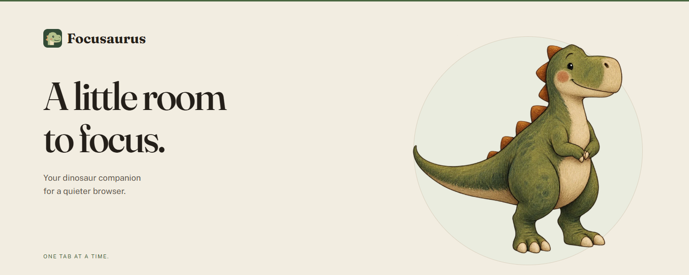

# Focusaurus

**A little room to focus.**

Focusaurus helps you pause distracting websites and get back to what you meant
to do—with Doug, a dinosaur who keeps things gentle.

Choose the sites that pull you away, start a focus session, and carry on with
your day. If you open a blocked site, Doug gives you a moment to pause before
you decide what to do next.

## Make space for what matters

- **Choose your distractions.** Start with groups such as social media, video,
  shopping, or games. Add your own sites, or block just one part of a site,
  such as YouTube Shorts.
- **Focus on your terms.** Pick 25, 50, or 90 minutes, or keep a session running
  until you finish. The toolbar shows how much time is left.
- **Interrupt the habit.** Take a 5- or 15-second pause before a temporary pass.
  Choose Locked mode for no temporary passes. You can always end a session
  from the extension's popup.
- **Set your work hours.** Schedule focus sessions for the days and times you
  choose. End one early and it stays off for the rest of that work window.
- **Notice patterns without keeping a diary.** See seven days of blocked-attempt
  counts. Older history clears automatically, and you can clear it yourself.
- **Make Doug feel at home.** Give your companion a name and choose a light,
  dark, or system-matched appearance.

## Your browsing stays yours

No account, advertising, or analytics. Your settings and recent attempt counts
stay in your browser; Focusaurus does not send them to us or automatically sync
them between devices.

Your browser asks for website access so Focusaurus can pause the sites you
choose. It does not read page contents or passwords. You can export your
settings and clear your history whenever you like.

[Read the privacy policy](PRIVACY.md).

## Get Focusaurus

**The Chrome Web Store release is being prepared.** A store installation link
will appear here when it is available. The Chrome release also works in Brave
and standard Chromium browsers. A Firefox desktop version is prepared too;
its store release will follow separately.

Want to try it before the store launch?

For Chrome or Chromium 140+, or a current Brave browser:

1. [Download the source ZIP](https://github.com/itsMattGuenther/Focusaurus/archive/refs/heads/main.zip)
   and unzip it into a folder you plan to keep.
2. Open `chrome://extensions` in Chrome/Chromium or `brave://extensions` in Brave.
3. Turn on **Developer mode**, choose **Load unpacked**, and select the extracted
   folder containing `manifest.json`.
4. Choose a category or add a site, then start your first session. Pin Focusaurus
   from your browser's Extensions menu to keep Doug close.

This is a development installation: updates are manual, and deleting or moving
its folder can stop it working. No programming tools are needed for these steps.
Firefox testing instructions are in the [developer guide](docs/DEVELOPMENT.md).

## A companion, not a lock on your computer

Focusaurus helps you follow your own intentions. It cannot stop you from ending
a session, disabling the extension, or using another browser or app. Browser
settings can also limit where it works. It does not measure time spent browsing.

## Help make it better

You do not need to write code to contribute. Tell us about a confusing moment,
a site that does not pause as expected, a wording improvement, or something
that makes Doug more helpful.

[Report a bug or suggest an improvement](https://github.com/itsMattGuenther/Focusaurus/issues/new/choose).
Please leave private browsing details, exported settings, and account information
out of public reports.

Want to contribute code, design, or documentation? Start with
[CONTRIBUTING.md](CONTRIBUTING.md). Build and test instructions live in the
[developer guide](docs/DEVELOPMENT.md).
